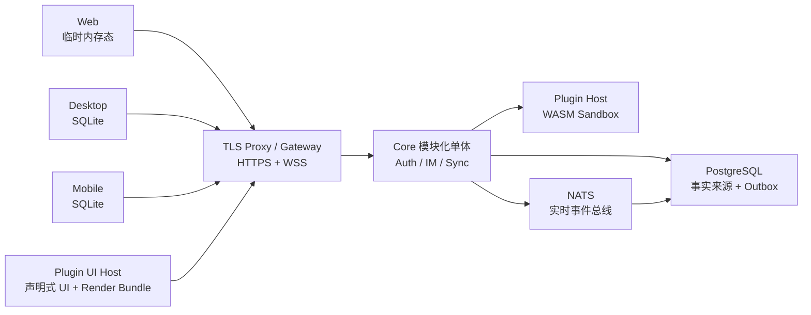
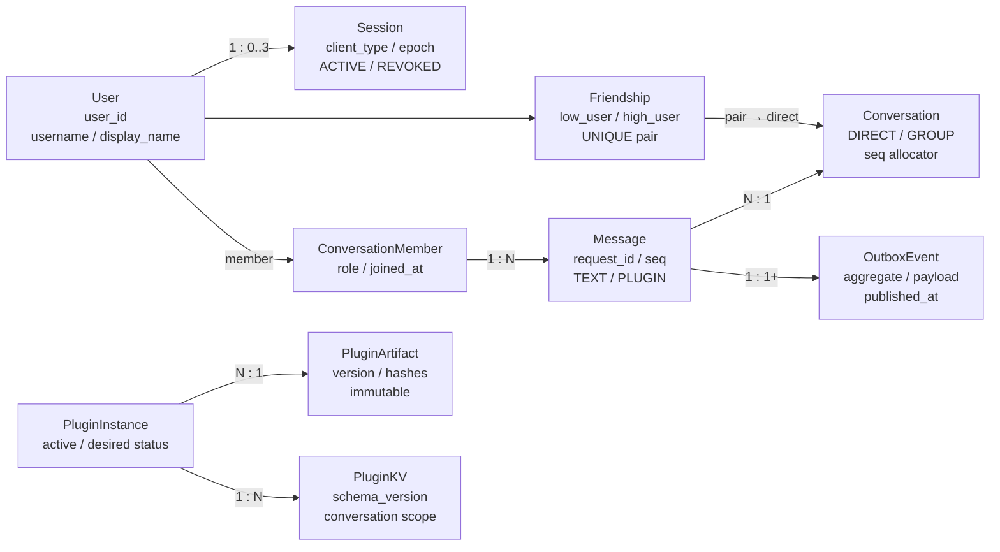
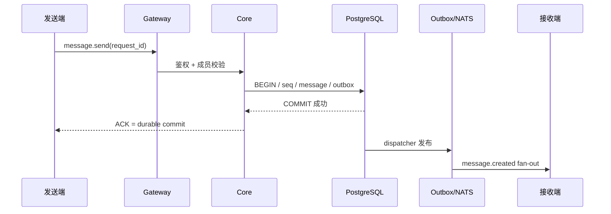
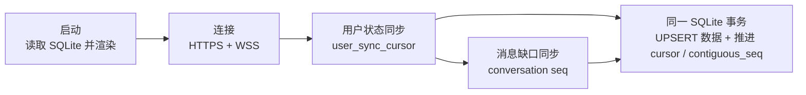
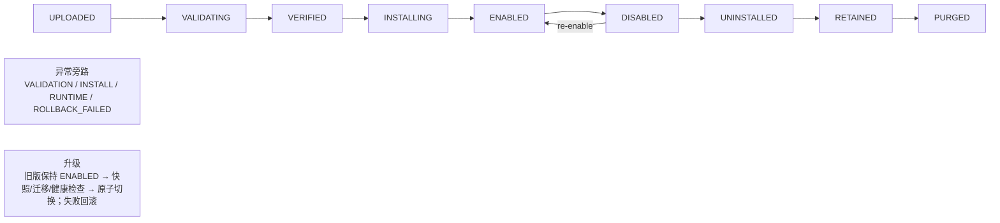
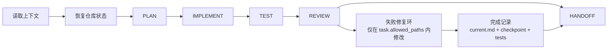
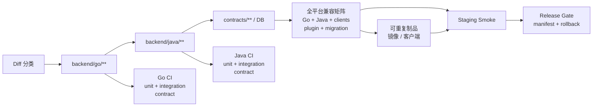
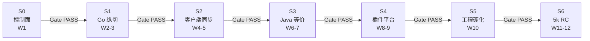

# 面向十万级在线连接的可扩展分布式即时通信平台

**架构基线 v1.0 · Frozen Architecture · Loop 1 执行版**

**正式架构方案 · Loop 1 可执行基线 · AI Agent 工作手册**

## 决策状态

本文件把当前对话中已冻结的架构决策固化为唯一执行基线。新 Agent 可据此启动，但不得绕过 spec/ 中的权威契约，也不得把未来目标写成当前能力。

| 文档属性 | 值 |
| --- | --- |
| 版本 | v1.0 |
| 基线日期 | 2026-09-19 |
| 执行周期 | Loop 1: 三个月 / 12 周预算窗口 |
| 推进机制 | 里程碑门禁驱动；Gate 提前通过即可立即进入下一阶段 |
| 当前容量验收 | 单机 8C / 16GB / 3TB；5000 authenticated WSS users |
| 未来容量目标 | Loop 2: 双机十万认证连接、N+1、定向路由与高级分布式状态 |

适用对象：架构负责人、实现 Agent、测试 Agent、Reviewer、CI/CD 维护者。
规范性关键词：MUST / MUST NOT 表示不可违反；SHOULD 表示默认遵循；MAY 表示允许但非必需。

## 目录

原 PDF 的章节及附录索引；各项可跳转至本 Markdown 的对应标题。

- [0. 执行摘要](#section-0) · 原 PDF 第 5 页
- [1. 项目目标、成功定义与边界](#section-1) · 原 PDF 第 6 页
  - [1.1 目标](#section-1-1) · 原 PDF 第 6 页
  - [1.2 Loop 1 成功定义](#section-1-2) · 原 PDF 第 6 页
  - [1.3 非目标与延后项](#section-1-3) · 原 PDF 第 6 页
- [2. 冻结架构原则与变更治理](#section-2) · 原 PDF 第 7 页
  - [2.1 Frozen Architecture 变更协议](#section-2-1) · 原 PDF 第 7 页
  - [2.2 权威顺序](#section-2-2) · 原 PDF 第 7 页
- [3. 系统总体架构与部署单元](#section-3) · 原 PDF 第 8 页
  - [3.1 三个物理部署单元](#section-3-1) · 原 PDF 第 8 页
  - [3.2 运行 profile](#section-3-2) · 原 PDF 第 8 页
  - [3.3 Loop 1 单机部署](#section-3-3) · 原 PDF 第 8 页
- [4. 领域模型与业务不变量](#section-4) · 原 PDF 第 9 页
  - [4.1 账号与 Session](#section-4-1) · 原 PDF 第 9 页
  - [4.2 好友与唯一私聊](#section-4-2) · 原 PDF 第 9 页
  - [4.3 群聊最小实现](#section-4-3) · 原 PDF 第 9 页
  - [4.4 消息身份与序号](#section-4-4) · 原 PDF 第 9 页
- [5. 消息写入、Outbox 与实时 fan-out](#section-5) · 原 PDF 第 10 页
  - [5.1 发送事务](#section-5-1) · 原 PDF 第 10 页
  - [5.2 NATS 与 Gateway fan-out](#section-5-2) · 原 PDF 第 10 页
  - [5.3 群聊 fan-out](#section-5-3) · 原 PDF 第 10 页
- [6. 客户端状态、本地存储与离线同步](#section-6) · 原 PDF 第 11 页
  - [6.1 三端差异](#section-6-1) · 原 PDF 第 11 页
  - [6.2 Optimistic write 与状态机](#section-6-2) · 原 PDF 第 11 页
  - [6.3 SQLite 事务不变量](#section-6-3) · 原 PDF 第 11 页
  - [6.4 双层 Cursor](#section-6-4) · 原 PDF 第 11 页
- [7. HTTPS/WSS/TLS 与认证协议](#section-7) · 原 PDF 第 12 页
  - [7.1 登录与 Token](#section-7-1) · 原 PDF 第 12 页
  - [7.2 WSS 状态机](#section-7-2) · 原 PDF 第 12 页
  - [7.3 Session 缓存一致性](#section-7-3) · 原 PDF 第 12 页
  - [7.4 传输与日志安全](#section-7-4) · 原 PDF 第 12 页
- [8. 插件平台架构](#section-8) · 原 PDF 第 13 页
  - [8.1 包结构与公共 API](#section-8-1) · 原 PDF 第 13 页
  - [8.2 Custom Render Bundle](#section-8-2) · 原 PDF 第 13 页
  - [8.3 WASM 后端 Sandbox](#section-8-3) · 原 PDF 第 13 页
- [9. 插件版本、热插拔与回滚](#section-9) · 原 PDF 第 14 页
  - [9.1 安装](#section-9-1) · 原 PDF 第 14 页
  - [9.2 升级与双版本共存](#section-9-2) · 原 PDF 第 14 页
  - [9.3 Disable / Uninstall / Purge](#section-9-3) · 原 PDF 第 14 页
  - [9.4 官方兼容 fixtures](#section-9-4) · 原 PDF 第 14 页
- [10. Monorepo 与规范控制面](#section-10) · 原 PDF 第 15 页
  - [10.1 spec/ 各目录的职责](#section-10-1) · 原 PDF 第 15 页
- [11. 公共契约与双后端实现](#section-11) · 原 PDF 第 16 页
  - [11.1 唯一权威](#section-11-1) · 原 PDF 第 16 页
  - [11.2 等价而非同构](#section-11-2) · 原 PDF 第 16 页
  - [11.3 Golden Contract Tests](#section-11-3) · 原 PDF 第 16 页
  - [11.4 数据库迁移](#section-11-4) · 原 PDF 第 16 页
- [12. AI Development Loop](#section-12) · 原 PDF 第 17 页
  - [12.1 Task Spec 模板](#section-12-1) · 原 PDF 第 17 页
  - [12.2 状态队列](#section-12-2) · 原 PDF 第 17 页
  - [12.3 Git 工作模式](#section-12-3) · 原 PDF 第 17 页
- [13. Agent 启动与交接协议](#section-13) · 原 PDF 第 18 页
  - [13.1 强制读取顺序](#section-13-1) · 原 PDF 第 18 页
  - [13.2 Handoff 必填项](#section-13-2) · 原 PDF 第 18 页
  - [13.3 Checkpoint 规则](#section-13-3) · 原 PDF 第 18 页
- [14. CI/CD 独立校验架构](#section-14) · 原 PDF 第 19 页
  - [14.1 路径感知规则](#section-14-1) · 原 PDF 第 19 页
  - [14.2 流水线层次](#section-14-2) · 原 PDF 第 19 页
  - [14.3 兼容矩阵](#section-14-3) · 原 PDF 第 19 页
  - [14.4 CI 与 Agent 的信任边界](#section-14-4) · 原 PDF 第 19 页
- [15. Loop 1: 12 周预算、里程碑门禁驱动](#section-15) · 原 PDF 第 20 页
- [16. Loop 1 性能与可靠性验收](#section-16) · 原 PDF 第 21 页
  - [16.1 固定环境与连接定义](#section-16-1) · 原 PDF 第 21 页
  - [16.2 必测场景](#section-16-2) · 原 PDF 第 21 页
  - [16.3 观测指标](#section-16-3) · 原 PDF 第 21 页
  - [16.4 Gate 判定](#section-16-4) · 原 PDF 第 21 页
- [17. Release、迁移与回滚规则](#section-17) · 原 PDF 第 22 页
  - [17.1 Release Manifest](#section-17-1) · 原 PDF 第 22 页
  - [17.2 发布规则](#section-17-2) · 原 PDF 第 22 页
  - [17.3 数据库迁移](#section-17-3) · 原 PDF 第 22 页
  - [17.4 回滚](#section-17-4) · 原 PDF 第 22 页
  - [17.5 发布失败判定](#section-17-5) · 原 PDF 第 22 页
- [18. 可观测性、安全与运维基线](#section-18) · 原 PDF 第 23 页
  - [18.1 关联标识](#section-18-1) · 原 PDF 第 23 页
  - [18.2 健康与就绪](#section-18-2) · 原 PDF 第 23 页
  - [18.3 安全清单](#section-18-3) · 原 PDF 第 23 页
  - [18.4 告警优先级](#section-18-4) · 原 PDF 第 23 页
- [19. 第一批 Agent 可执行任务](#section-19) · 原 PDF 第 24 页
- [20. 后续任务队列与依赖](#section-20) · 原 PDF 第 25 页
  - [20.1 依赖纪律](#section-20-1) · 原 PDF 第 25 页
- [21. Agent 首日执行清单](#section-21) · 原 PDF 第 26 页
  - [21.1 第 0-2 小时](#section-21-1) · 原 PDF 第 26 页
  - [21.2 第一个实现回合](#section-21-2) · 原 PDF 第 26 页
  - [21.3 Agent 的停止条件](#section-21-3) · 原 PDF 第 26 页
- [附录 A. Gate Checklist](#appendix-a) · 原 PDF 第 27 页
- [附录 B. 冻结不变量速查](#appendix-b) · 原 PDF 第 28 页

<a id="section-0"></a>
## 0. 执行摘要

本项目构建一个前后端分离、多端、多实现、插件一等公民的分布式即时通信平台。题目中的“十万级”描述平台的扩展方向，不等于 Loop 1 已验收十万连接。Loop 1 先用单机 8C/16GB/3TB 完成 5000 个真实认证 WSS 用户的正确性与容量基线；通过后，双机十万连接正式验收延后至 Loop 2。



> 图 0-1 总体逻辑架构：PostgreSQL 是事实来源，NATS 是实时通知总线；Gateway 只承担接入与 fan-out。

> 原图同时绘有 NATS → PostgreSQL 连线；此处照录其方向。该线的具体运行含义未在原图标注，不据此改变正文对 PostgreSQL 事实来源与 NATS 实时通知总线的定义。

#### 四条总纲

1. 公共契约是唯一权威，Go 与 Java/Spring 只是独立实现；
2. 消息可靠性来自 PostgreSQL + Outbox + Sync，不来自 NATS；
3. Agent 可改代码但无权自行宣布正确，CI 是独立事实裁判；
4. 未经架构决策流程，任何 Agent 不得修改 frozen architecture。

| 维度 | Loop 1 必须完成 | 明确不进入 Loop 1 |
| --- | --- | --- |
| 业务 | 账号、搜索、最小好友、唯一私聊、最小群聊、纯文本、插件消息 | 音视频、文件、朋友圈、超级群、陌生人拉群 |
| 客户端 | Web 临时态；Desktop/Mobile SQLite、离线历史、optimistic write | Web 本地历史数据库；离线创建需要服务端确认的业务操作 |
| 后端 | Go 与 Java/Spring 两套独立 profile，行为等价 | Go/Java 混合集群生产流量 |
| 容量 | 单机 5000 authenticated WSS users | 双机 100000 正式验收、N+1 满负载 |
| 基础设施 | PostgreSQL、Core NATS、TLS Proxy、Docker Compose | 为“看起来分布式”而预先加入 Redis/Kafka/分库分表 |

<a id="section-1"></a>
## 1. 项目目标、成功定义与边界

<a id="section-1-1"></a>
### 1.1 目标

- 以 HTTPS/WSS/TLS 提供真实认证、多端同步的即时通信纵向闭环。

- 用同一套公共契约证明 Go 与 Java/Spring 两套独立后端可替换，客户端无需改动。

- 把插件平台作为一等公民：WASM 后端 sandbox + 全客户端 UI Extension + 经审查的 Custom Render Bundle。

- 建立 AI 全流程自动化开发的控制面，使新 Agent 只通过 spec + contracts + progress + tasks 即可恢复工作。

- 以门禁和自动化证据驱动进度；12 周是预算，不是等待日历。

<a id="section-1-2"></a>
### 1.2 Loop 1 成功定义

| 验收域 | 不可省略的证据 |
| --- | --- |
| 业务 E2E | 注册/登录 -> 搜索 -> 添加好友 -> 自动出现唯一私聊 -> 文本消息 -> 从好友列表创建群聊 -> 群消息 -> 安装/使用插件 |
| 消息正确性 | ACK 仅在 durable commit 后；同一 request_id 重试不产生重复逻辑消息；离线恢复无永久 gap |
| 客户端 | Desktop/Mobile SQLite 事务 UPSERT；SENDING/SENT/FAILED；Web 不保存历史 |
| 实现等价 | Go profile 与 Java profile 分别通过同一 Golden Contract Tests；客户端不改代码 |
| 工程体系 | path-aware CI、兼容矩阵、迁移测试、插件 fixture、Release Manifest、rollback rehearsal |
| 容量 | 单机 8C/16GB/3TB，5000 个已完成 TLS/WSS/auth.bind/session validation 的在线用户 |

<a id="section-1-3"></a>
### 1.3 非目标与延后项

#### Loop 2 范围

双机正式部署与十万 authenticated WSS connections；N+1 failover；Gateway targeted routing；更高级的分布式Session/Presence；超级群；进一步水平扩展。Loop 1 文档与代码可以预留扩展点，但不得以此扩大当前实现范围。

Loop 1 不把 Redis、Kafka、分库分表、自动数据库切主视为必选项。只有基于压测、故障证据和新 ADR 才能引入。两节点环境不具备安全自动 quorum failover 条件；生产级自动切主须等待第三方 witness 或更多节点。

<a id="section-2"></a>
## 2. 冻结架构原则与变更治理

| ID | 冻结决策 | 强制约束 |
| --- | --- | --- |
| F-01 | 公共契约唯一权威 | HTTPS、WSS、错误码、领域语义、Sync、Plugin API 先定义，两个后端不得各自发明 |
| F-02 | 双后端独立实现 | 100% Go profile 或 100% Java/Spring profile；Loop 1 不混跑 |
| F-03 | PostgreSQL 是事实来源 | 消息、会话、Session、插件状态持久化；NATS 丢事件不能造成永久数据缺失 |
| F-04 | Transactional Outbox | message 与 outbox 同一事务；ACK 表示 durable commit |
| F-05 | Gateway 轻业务 | 接入、鉴权绑定、连接注册、限流、协议路由、local fan-out；业务规则在 Core |
| F-06 | 双层同步游标 | 用户低频状态用 user_sync_cursor；消息用 conversation seq + contiguous_seq |
| F-07 | 客户端差异 | Web memory only；Desktop/Mobile SQLite materialized view |
| F-08 | 插件最小权限 | 所有能力经 capability/permission；Render Bundle 审查 + sandbox；不可直接触达宿主敏感资源 |
| F-09 | 门禁驱动 | Gate PASS 立即前进；Gate FAIL 必须留在阶段修复 |
| F-10 | CI 独立裁判 | Agent 的自检不是验收；合并与发布只依据独立流水线证据 |

<a id="section-2-1"></a>
### 2.1 Frozen Architecture 变更协议

- 禁止：直接修改 frozen spec / contracts / DB invariants / plugin security boundary
- 允许：创建 Architecture Change Proposal (ACP) 或 ADR 草案
- 流程：提出动机 -> 影响分析 -> 兼容/迁移/回滚方案 -> 架构负责人批准 -> 更新契约 -> 全平台兼容 CI -> 实施

Agent 遇到与 frozen architecture 冲突的任务时必须停止该冲突部分，在任务记录中标记 BLOCKED_BY_ARCHITECTURE，并提出最小决策问题。不得用“实现方便”作为静默改变协议、唯一约束、ACK 语义或安全边界的理由。

<a id="section-2-2"></a>
### 2.2 权威顺序

1. spec/architecture/decisions/ (已批准 ADR / frozen decision)

2. contracts/ (机器可验证的公共契约)

3. spec/domain/ + spec/invariants/

4. spec/acceptance/ (Gate 与验收证据)

5. spec/tasks/ (任务局部范围)

6. implementation (不得反向定义契约)

<a id="section-3"></a>
## 3. 系统总体架构与部署单元


> 图 3-1 逻辑组件图。

> 原图同时绘有 NATS → PostgreSQL 连线；此处照录其方向。该线的具体运行含义未在原图标注，不据此改变正文对 PostgreSQL 事实来源与 NATS 实时通知总线的定义。

<a id="section-3-1"></a>
### 3.1 三个物理部署单元

| 部署单元 | 职责 | 明确不负责 |
| --- | --- | --- |
| gateway | TLS 之后的 WSS 生命周期、auth.bind、session/cache 校验、connection registry、协议路由、local fan-out、heartbeat/限流 | 好友/群成员规则、消息持久化、插件业务逻辑 |
| core | Auth、Session、User、Friendship、Conversation、Message、Sync、Outbox；模块化单体 | 不可信插件执行；大量 socket 连接状态 |
| plugin-host | WASM runtime、事件分派、Query/Action 代理、资源限制、熔断、编译缓存 | 直接访问数据库/文件/任意网络；成为 IM 主链单点 |

<a id="section-3-2"></a>
### 3.2 运行 profile

```text
docker compose --profile go up
# gateway-go + core-go + plugin-host-go adapter + shared PostgreSQL/NATS/TLS
docker compose --profile java up
# gateway-java + core-java + plugin-host adapter + same canonical schema/contracts
```

profile 的目标是行为可替换，不是源码结构相同。Go 与 Java 可使用各自惯用的框架和组织方式，但必须共享：公共契约、数据库迁移语义、错误码、测试向量、插件 API、Release Manifest 格式。

<a id="section-3-3"></a>
### 3.3 Loop 1 单机部署

| 层 | Loop 1 单机部署规则 |
| --- | --- |
| 入口 | TLS reverse proxy 暴露 HTTPS/WSS；所有测试流量经过真实入口 |
| 服务 | 仅启动一个后端 profile；gateway/core/plugin-host 可为独立进程/容器 |
| 数据 | PostgreSQL 单实例；所有 migration 有 forward/rollback 规则 |
| 事件 | Core NATS，默认非事实来源；Outbox dispatcher 可重放 |
| 存储 | 3TB 是机器容量约束，不代表测试必须填满；记录实际占用与增长 |

<a id="section-4"></a>
## 4. 领域模型与业务不变量



> 图 4-1 UML 领域关系概览。字段仅显示关键不变量；完整 schema 由 contracts/database 管理。

<a id="section-4-1"></a>
### 4.1 账号与 Session

每个用户拥有 WEB、DESKTOP、MOBILE 三个登录槽位。每种 client_type 同时最多一个有效 Session，但三种端可同时登录。同端新登录必须在事务中撤销旧 Session 并递增 session_epoch。PostgreSQL 是登录状态权威；Gateway 内存是在线连接与路由缓存。

- UNIQUE(user_id, client_type)
- Access Token: user_id, session_id, client_type, session_epoch, iat, exp
- Refresh Token: 只存 hash，可独立撤销
- WSS: 先建立 TLS/WebSocket，再发送 auth.bind；禁止 token 放 URL query

<a id="section-4-2"></a>
### 4.2 好友与唯一私聊

Loop 1 不做好友申请审批。添加好友表示即时建立双向关系，并在同一事务中创建或取得唯一 DIRECT Conversation。好友关系使用规范化无向 pair：low=min(A,B)、high=max(A,B)。

- friendships: UNIQUE(user_low_id, user_high_id)
- DIRECT conversation: UNIQUE(direct_user_low_id, direct_user_high_id)
- 事务: friendship + direct conversation + two members + sync events + outbox -> COMMIT

<a id="section-4-3"></a>
### 4.3 群聊最小实现

发起者只能从自己的好友列表选择成员。创建请求必须带 request_id 以避免网络重试重复建群。事务写入 GROUP Conversation、成员、用户状态同步事件与 outbox。Loop 1 不含邀请链接、二维码、陌生人拉群、复杂管理员审批。

<a id="section-4-4"></a>
### 4.4 消息身份与序号

| 身份 | 约束 | 用途 |
| --- | --- | --- |
| 客户端逻辑身份 | UNIQUE(conversation_id, request_id) | SQLite 本地发送、ACK、重试、Sync 收敛 |
| 服务端幂等身份 | UNIQUE(sender_id, conversation_id, request_id) | 跨重试/节点避免重复逻辑消息 |
| 服务端正式身份 | UNIQUE(server_message_id) | 全局记录身份 |
| 顺序 | UNIQUE(conversation_id, seq) | 会话内单调递增、缺口检测与历史分页 |

<a id="section-5"></a>
## 5. 消息写入、Outbox 与实时 fan-out



> 图 5-1 私聊消息时序图。ACK 的唯一成功语义是 message 与 outbox 已持久化提交。

<a id="section-5-1"></a>
### 5.1 发送事务

1. BEGIN
2. 校验 sender 是 conversation member
3. 幂等查询/冲突处理 (sender_id, conversation_id, request_id)
4. 锁定/更新 conversation sequence row
5. INSERT message(seq, ...)
6. INSERT outbox_event(message.created, ...)
7. COMMIT
8. 返回 ACK(message_id, seq, server_created_at)

第一轮 sequence row 允许成为热门会话热点，因为它最直观且易验证。只有压测证明竞争不可接受时，才通过 ADR 评估 range allocation 等演进方案。

<a id="section-5-2"></a>
### 5.2 NATS 与 Gateway fan-out

- Outbox dispatcher 发布 message.created 到 NATS，并以可重试方式标记 published。

- Gateway 订阅需要的实时事件，并只向本机活跃连接 fan-out。

- 收件人的所有在线端、发送者的其他在线端接收 message.created；发送端原连接由 ACK 收敛。

- NATS 事件可重复，消费者必须幂等；NATS 事件可短暂错过，Sync 必须最终补齐。

- Loop 1 不把 NATS JetStream 作为消息事实来源，也不为每个群成员写一条持久投递记录。消息写一次，在线端由

Gateway 读扩散。

<a id="section-5-3"></a>
### 5.3 群聊 fan-out

GROUP 消息仍只写一条 message 和一条 outbox 事件。Gateway 根据会话在线成员执行 local fan-out。普通群最大成员数不在设计阶段拍脑袋固定，应由 10/50/200/500 成员等阶梯测试结果决定。

#### 消息正确性红线

lost committed messages = 0；duplicate logical messages = 0；wrong conversation delivery = 0；permanent seq gap = 0；ACK-before-commit = 0。

<a id="section-6"></a>
## 6. 客户端状态、本地存储与离线同步

<a id="section-6-1"></a>
### 6.1 三端差异

| 客户端 | 本地持久化 | 离线历史 | 启动行为 |
| --- | --- | --- | --- |
| Web | 无聊天 DB；Memory only | 不补聊天历史；登录后获取当前好友/会话状态 | HTTPS 登录 -> WSS auth.bind -> 仅展示本会话实时数据 |
| Desktop | 按账号独立 SQLite + OS secure token storage | 支持 | 先读 SQLite 立即渲染，再后台同步 |
| Mobile | 按账号独立 SQLite + OS secure token storage | 支持 | 先读 SQLite 立即渲染，再后台同步 |

<a id="section-6-2"></a>
### 6.2 Optimistic write 与状态机

1. 用户点击发送
2. -> 生成不可变 request_id
3. -> SQLite 事务 UPSERT，state=SENDING
4. -> UI 立即渲染
5. -> WSS message.send
6. -> ACK: SENT + server_message_id + seq + server_time
7. -> timeout/offline: FAILED
8. -> Retry: 复用相同 request_id，FAILED -> SENDING

FAILED 仅表示当前尝试没有收到成功确认，不证明服务端未提交。SENT 是终态，不能倒退到 FAILED。Sync 若看到本地FAILED 但服务端已有相同 (conversation_id, request_id)，必须 UPSERT 为 SENT，而不是新增一行。

<a id="section-6-3"></a>
### 6.3 SQLite 事务不变量

- UNIQUE(conversation_id, request_id)
- UNIQUE(server_message_id) WHERE server_message_id IS NOT NULL
- UNIQUE(conversation_id, server_seq) WHERE server_seq IS NOT NULL
- 所有本地发送 / ACK / WSS realtime / Sync 均走事务 UPSERT
- 业务数据变更与 cursor / contiguous_seq 推进必须在同一事务



> WSS 实时流与 Sync 补偿流允许交叉，靠唯一约束和事务收敛，不暂停实时推送。
>
> 图 6-1 双层同步与本地收敛。

<a id="section-6-4"></a>
### 6.4 双层 Cursor

user_sync_cursor 只承载 friend、conversation、membership、plugin 等低频用户状态。消息不进入用户级事件流，以避免群消息按成员写放大。每个会话维护 contiguous_seq，只有本地从旧值开始连续无缺口时才能前移。

<a id="section-7"></a>
## 7. HTTPS/WSS/TLS 与认证协议

<a id="section-7-1"></a>
### 7.1 登录与 Token

- POST /auth/login 包含 username/password、client_type、device_id、client_version、protocol_version。

- Access Token 短期、Refresh Token 长期；具体时长是配置，不写死进协议。

- Web 优先使用 HttpOnly Secure Cookie 持有 Refresh Token；原生端使用 OS secure storage。

- 显式 logout 撤销 Session、Refresh Token 与 WSS；退出登录不等于立即删除本地 SQLite。

<a id="section-7-2"></a>
### 7.2 WSS 状态机

1. TCP/TLS -> WebSocket Upgrade -> UNAUTHENTICATED
2. UNAUTHENTICATED 只允许 auth.bind 与 ping/pong
3. auth.bind 校验签名、exp、session_id、client_type、session_epoch
4. 成功 -> AUTHENTICATED，socket 永久绑定 user/session/client_type
5. 同端新登录 -> session.revoked -> 推送旧连接 -> close

<a id="section-7-3"></a>
### 7.3 Session 缓存一致性

Core 在 Session 创建/撤销事务中写 outbox；Gateway 经 NATS 更新内存映射 (user_id, client_type) ->session_id/epoch/connection_id。每条消息不查询 PostgreSQL。实时撤销事件是体验优化；数据库权威状态和 epoch 确保旧 token 最终无法重连。

<a id="section-7-4"></a>
### 7.4 传输与日志安全

| 规则 | 要求 |
| --- | --- |
| 传输 | 生产入口仅 HTTPS/WSS/TLS；禁用明文回退 |
| Token | 禁止放 URL query；禁止写应用日志/trace；错误响应不得回显 |
| 密码 | 只存强哈希；凭证与普通用户资料分离 |
| 插件 | 永不向 Custom Renderer 暴露认证 token 或 SQLite 直连 |
| 日志 | request_id/message_id 可观测；消息正文默认不进入结构化日志 |

<a id="section-8"></a>
## 8. 插件平台架构

<a id="section-8-1"></a>
### 8.1 包结构与公共 API

```text
plugin.pkg
├── manifest.json
├── backend/plugin.wasm
└── ui/
├── render.bundle.js
├── render.css
└── assets/
```

Plugin API v1 = Events + Queries + Actions + UI Host API

| 面 | 能力 | 约束 |
| --- | --- | --- |
| Events | message.created、member.joined、plugin lifecycle 等 | 仅订阅 manifest 声明且已授权的事件 |
| Queries | 读取被授权的会话、成员、消息、插件私有状态 | 只读、分页、限额；不可直接访问 Core 内部服务/DB |
| Actions | 发送消息、更新插件状态、触发允许的 UI 行为 | 每个 Action 重新鉴权、幂等与审计 |
| UI Host | Page/Modal/Panel/Menu/Form/Toolbar/Message Renderer 等 | 完整 UI 扩展能力不等于宿主 OS 权限 |

<a id="section-8-2"></a>
### 8.2 Custom Render Bundle

所有客户端都支持声明式 UI 与 Custom Render Bundle 两档。自定义包在加载前必须完成 package hash、签名、manifest schema、Plugin API 兼容、权限、大小/资源、CSP 与入口检查；运行时在 sandbox iframe 或 isolated WebView 中执行，并且只能通过白名单 Plugin Bridge 调用 Host API。

#### 不可变制品

UNIQUE(plugin_id, version)。同一版本的 package/backend/renderer hash 变化必须拒绝。消息数据与渲染代码分离，历史插件消息携带 plugin_id、plugin_version、renderer 与 fallback TEXT；客户端必须保留仍被历史消息引用的旧 renderer。

<a id="section-8-3"></a>
### 8.3 WASM 后端 Sandbox

- 默认不可访问数据库、服务器文件、任意 socket、其他插件内存。

- 资源边界包括 CPU/执行时长、内存、并发、存储配额与网络策略。

- 持久状态在 PostgreSQL plugin_kv；WASM 执行尽量无状态，可缓存编译 module。

- 连续 timeout/panic/limit violation 达阈值后 AUTO_DISABLED，并通知 Conversation Owner；IM 主链继续工作。

<a id="section-9"></a>
## 9. 插件版本、热插拔与回滚



> 图 9-1 插件制品与实例生命周期。Artifact 状态和 Conversation 下 Instance 状态必须分离。

<a id="section-9-1"></a>
### 9.1 安装

1. 检查安装权限 -> Artifact VERIFIED -> API compatibility -> 权限确认
2. BEGIN: plugin_instance=INSTALLING + grants + sync_event + outbox -> COMMIT
3. 异步: preload WASM + client bundle fetch + health check
4. 成功: ENABLED；失败: INSTALL_FAILED，不影响 IM 主服务

<a id="section-9-2"></a>
### 9.2 升级与双版本共存

Plugin Instance 维护 active_version、desired_version、previous_version。升级期间旧版保持服务：安装新版 -> plugin_kv 快照 -> storage migration -> backend/renderer 健康检查 -> 原子切换。任何一步失败都恢复快照并继续旧版。Backend WASM 与 Renderer Bundle 属于同一制品版本，不允许拆开升级。

<a id="section-9-3"></a>
### 9.3 Disable / Uninstall / Purge

| 操作 | 运行行为 | 数据 |
| --- | --- | --- |
| DISABLE | 停止接收新事件与产生 Action，隐藏入口，可重新 enable | 保留 |
| UNINSTALL | Conversation 不再持有活动实例 | 默认 RETAINED |
| PURGE | 显式不可逆清理操作；需要高权限和审计 | 删除前必须确认保留策略 |

<a id="section-9-4"></a>
### 9.4 官方兼容 fixtures

Loop 1 必须提供 Echo Plugin 和 Poll Plugin。Echo 验证 event -> WASM -> action -> message；Poll 验证 PLUGIN message、Custom Renderer、plugin storage、客户端 UI 交互与 fallback TEXT。这两个插件进入持续兼容矩阵。

<a id="section-10"></a>
## 10. Monorepo 与规范控制面

```text
/
├── spec/
│ ├── architecture/
│ │ ├── overview.md
│ │ ├── service-boundaries.md
│ │ └── decisions/ # ADR + frozen decisions
│ ├── domain/ # auth/user/friend/conversation/message/sync/plugin
│ ├── invariants/ # 跨语言不可变量
│ ├── acceptance/ # loop-1.md + stage gates
│ ├── progress/
│ │ ├── current.md
│ │ └── checkpoints/
│ ├── handoff/agent-context.md
│ └── tasks/{backlog,ready,active,review,done}/
├── contracts/
│ ├── http/
│ ├── websocket/
│ ├── errors/
│ ├── database/
│ ├── plugin-api/
│ └── fixtures/ # golden vectors / old clients / plugins
├── backend/
│ ├── go/{gateway,core,plugin-host,tests}/
│ └── java/{gateway,core,plugin-host,tests}/
├── clients/
│ ├── shared/{protocol-sdk,plugin-sdk,ui}/
│ ├── web/
│ ├── desktop/
│ └── mobile/
├── plugins/fixtures/{echo,poll}/
├── tests/{contract,integration,e2e,compatibility,load}/
├── deploy/{compose,proxy,observability}/
├── ci/
└── tools/
```

<a id="section-10-1"></a>
### 10.1 spec/ 各目录的职责

| 路径 | 回答的问题 | 禁止内容 |
| --- | --- | --- |
| architecture/decisions | 为什么这样设计，哪些已经冻结？ | 临时实现笔记 |
| domain | 业务对象与行为是什么？ | 某语言的类结构 |
| invariants | 无论实现如何都必须成立什么？ | 性能猜测 |
| acceptance | 怎样判定阶段/Loop 通过？ | 不可验证的“基本完成” |
| progress/current.md | 现在整体在哪里？最后已验证状态是什么？ | 任务细节堆积 |
| checkpoints | 稳定里程碑的可恢复快照是什么？ | 每次小编辑日志 |
| handoff/agent-context.md | 新 Agent 先知道什么？ | 重复全部文档 |
| tasks | 下一件可执行工作是什么？允许修改哪里？ | 架构自由发挥 |

<a id="section-11"></a>
## 11. 公共契约与双后端实现

<a id="section-11-1"></a>
### 11.1 唯一权威

Canonical Contracts 位于 contracts/，同时驱动 Go、Java/Spring 和客户端 SDK。契约包含 OpenAPI/HTTP、WSS envelope 与消息类型、错误码、协议版本与 capabilities、数据库 schema/migrations、Plugin API、Golden Test Vectors。实现代码不得成为反向权威。

<a id="section-11-2"></a>
### 11.2 等价而非同构

| 必须相同 | 允许不同 |
| --- | --- |
| HTTP/WSS 可观察行为、错误码、事务语义、幂等、顺序、Sync、插件权限、数据库结果 | 框架、包结构、依赖注入、ORM/SQL 工具、线程/协程模型、内部接口 |
| Release Manifest、健康检查、metrics 标签、日志关联字段 | 内部模块名称与代码风格 |

<a id="section-11-3"></a>
### 11.3 Golden Contract Tests

```text
同一 fixture 输入 -> Go profile -> 规范化结果 A
同一 fixture 输入 -> Java profile -> 规范化结果 B
断言 A == Canonical Expected && B == Canonical Expected
必须覆盖：auth/session、friend/direct uniqueness、group idempotency、message ACK/outbox、retry、sync gap、plugin permissions、errors/version negotiation
```

<a id="section-11-4"></a>
### 11.4 数据库迁移

两套后端共享数据库语义，但单次部署只运行一个 profile。migration 由独立迁移组件执行，不允许应用实例竞争执行。所有兼容窗口内的服务与客户端 fixture 必须通过 migration 测试。破坏性 schema 变更采用 expand -> migrate/backfill-> switch -> contract，多版本共存期间禁止先删旧字段。

<a id="section-12"></a>
## 12. AI Development Loop



> 职责隔离可以由不同 Agent 或同一模型的不同上下文阶段实现；验收依据始终是 spec + contracts + diff + test result。
>
> 图 12-1 Agent 工作流。开发自动化和 CI/CD 是两个独立系统。

<a id="section-12-1"></a>
### 12.1 Task Spec 模板

```text
task_id: LOOP1-MSG-003
goal: implement WSS text message sending
inputs:
 - spec/domain/messaging.md
 - spec/invariants/messaging.md
 - contracts/websocket/message/
allowed_paths:
 - backend/go/internal/message/**
 - backend/go/internal/outbox/**
 - backend/go/tests/**
acceptance:
 - contract tests pass
 - retry is idempotent
 - ACK only after durable commit
forbidden:
 - change public contract
 - change DB contract without migration
 - modify Java implementation
```

<a id="section-12-2"></a>
### 12.2 状态队列

backlog -> ready -> active -> review -> done

- 进入 ready: inputs 完整、依赖完成、验收可执行
- 进入 active: 分配唯一 owner/agent、建立 task branch
- 进入 review: 实现完成 + 本地最小验证 + handoff 完整
- 进入 done: 独立 CI Gate PASS + review 接受 + progress 更新

<a id="section-12-3"></a>
### 12.3 Git 工作模式

采用 main + task/，不引入复杂 GitFlow。每个任务独立分支、最小提交、CI、Review 后合并。Agent 不得长期堆积跨任务改动，也不得为了让 CI 变绿而修改无关测试或公共契约。

<a id="section-13"></a>
## 13. Agent 启动与交接协议

<a id="section-13-1"></a>
### 13.1 强制读取顺序

| 顺序 | 必须读取 | 退出条件 |
| --- | --- | --- |
| 1 | spec/handoff/agent-context.md | 理解项目边界、frozen decisions 与工作方式 |
| 2 | spec/progress/current.md | 知道当前 Stage、Gate、最后已验证commit、blockers |
| 3 | spec/tasks/active/.md；若无 active 则选 ready 首项 | 确认 goal、allowed_paths、acceptance、forbidden |
| 4 | 任务引用的 domain/invariants/decisions/contracts | 能复述不可变量和输入输出 |
| 5 | git status、当前 diff、最近提交 | 识别用户/前 Agent 未完成改动，不覆盖 |
| 6 | 最小基线验证 | 确认仓库状态可继续；失败则记录而非盲改 |
| 7 | PLAN -> IMPLEMENT -> TEST -> REVIEW | 仅在授权路径与任务范围内工作 |

<a id="section-13-2"></a>
### 13.2 Handoff 必填项

- Current task / stage / gate
- Completed work
- Files and migrations changed
- Tests: command + result + evidence location
- Known failures / risks / assumptions
- Next exact action
- Last known good commit
- Uncommitted changes and ownership
- Architecture conflicts or ACP/ADR required

<a id="section-13-3"></a>
### 13.3 Checkpoint 规则

稳定 Gate、重要纵向链路、schema/contract 版本切换或可恢复发布点必须生成 checkpoint。checkpoint 记录 commit、contract version、migration level、image digests、fixture versions、通过的 Gate 与已知限制。current.md 始终指向最新 checkpoint，而不是复制其全部内容。

#### 崩溃恢复目标

新的 Agent 不扫描整个仓库重新猜架构。它通过 agent-context -> current -> active task -> referenced specs/contracts -> git diff 在一个可控上下文中恢复工作。

<a id="section-14"></a>
## 14. CI/CD 独立校验架构



> Agent 负责提出变更；CI 独立验证事实。Agent 无权自行宣布 Gate 通过。
>
> 图 14-1 Path-aware CI DAG。公共契约变更是唯一需要无条件放大全平台验证的路径。

<a id="section-14-1"></a>
### 14.1 路径感知规则

| 变更路径 | 必跑作业 |
| --- | --- |
| backend/go/** | Go lint/unit/integration/contract；不默认跑 Java |
| backend/java/** | Java lint/unit/integration/contract；不默认跑 Go |
| clients/web/** | Web unit/build/protocol/plugin UI tests |
| clients/desktop/** 或 clients/mobile/** | 对应客户端 + SQLite migration + protocol tests |
| contracts/**、数据库迁移、shared protocol/plugin SDK | Go + Java + Web + Desktop + Mobile + old client fixtures + plugin fixtures + migration compatibility |
| deploy/**、ci/** | compose/manifest/security/smoke/rollback validation |

<a id="section-14-2"></a>
### 14.2 流水线层次

static/lint -> unit -> contract -> integration -> compatibility -> build
-> immutable artifacts -> SBOM/signature -> staging deploy -> smoke/E2E
-> release gate -> canary/controlled rollout -> observe -> complete or rollback

<a id="section-14-3"></a>
### 14.3 兼容矩阵

最低矩阵包含 Client Protocol v1、v2、HEAD；Go/Java profile；Echo/Poll 插件 fixture；SQLite old schema fixtures。服务端只维护一个当前实现版本与有限兼容窗口。latest/recommended/min_supported 必须在 Release Manifest 中显式声明，客户端版本号与 protocol_version 不绑定。

<a id="section-14-4"></a>
### 14.4 CI 与 Agent 的信任边界

Agent 可运行本地测试并提交证据，但 Gate 只能由隔离 Runner 从干净 checkout 重建后判定。任何需要跳过测试、重录 golden fixture、降低阈值或更改验收项的动作都视为架构/验收变更，必须单独审批。

<a id="section-15"></a>
## 15. Loop 1: 12 周预算、里程碑门禁驱动



> 提前通过即立即进入下一阶段；任何必需项失败则留在当前阶段修复。周数仅是预算窗口。
>
> 图 15-1 依赖图而非固定甘特图。周数表示预算窗口；Gate 决定实际前进时间。原图在 S0 至 S6 七个阶段下方均标有 Gate PASS；连线上的标签表示逐阶段通过，末阶段的 Gate PASS 仍须单独判定。

#### Execution Policy

This loop is milestone-gated, not calendar-gated. A stage MAY begin immediately once all acceptance criteria of the previous stage pass. Agents MUST NOT wait for a scheduled date after Gate PASS, and MUST NOT advance while any required criterion is failed or unresolved.

| 阶段 | 预算窗口 | 范围 | Gate 证据 |
| --- | --- | --- | --- |
| S0 控制面 | W1 | Monorepo、spec/contracts/tasks/progress、CI skeleton、Compose、PostgreSQL/NATS/TLS；冻结 HTTP/WSS/Error/Session/Message/Sync/Plugin API v1 | 新 Agent 仅靠控制面可定位项目、状态、下一任务；契约 lint 与 skeleton CI PASS |
| S1 Go 纵向链路 | W2-3 | 注册/登录、WSS、搜索、好友、唯一私聊、文本发送、ACK、持久化、Outbox、NATS | A 搜索/添加 B 后发 hello，B 实时收到；contract/integration PASS |
| S2 客户端与Sync | W4-5 | Desktop/Mobile SQLite、optimistic write、retry、双层 cursor、离线恢复；Web 最简实时态 | ACK 丢失重试不重复；离线 101..500 完整恢复；FAILED 可被 Sync 收敛为 SENT |
| S3 Java 等价 | W6-7 | Auth/Session/User/Friend/Conversation/Message/Sync/Outbox/NATS | 两 profile 同一 Golden Tests PASS；客户端零改动切换 |
| S4 插件平台 | W8-9 | Registry、Manifest、Permission、WASM、UI Host、Render Bundle、生命周期、Echo/Poll | 两个 fixture 在三端与双后端兼容；sandbox/权限负例 PASS |
| S5 工程硬化 | W10 | path-aware CI、compatibility matrix、migration/plugin tests、Release Manifest、rollback/security | Compatibility CI 可复现；无硬编码跳过；回滚演练 PASS |
| S6 性能与 RC | W11-12 | 500/1000/2500/5000 阶梯压测、profile、修复、soak、RC、architecture snapshot | 单机 5k authenticated WSS Gate PASS；正确性零红线违例；RC 可回滚 |

<a id="section-16"></a>
## 16. Loop 1 性能与可靠性验收

<a id="section-16-1"></a>
### 16.1 固定环境与连接定义

| 项 | Loop 1 定义 |
| --- | --- |
| 被测机 | 单机 8C / 16GB / 3TB；记录 OS、内核、容器限制、文件描述符、网络参数 |
| 连接数 | 5000 authenticated WSS users，不是空 TCP socket |
| 认证链 | TLS -> WebSocket Upgrade -> auth.bind -> Session validation -> Gateway registry -> heartbeat |
| 入口 | Load Generator 必须经过 TLS reverse proxy / 真实入口 |
| 后端 | Go profile 与 Java profile 分开测试、分开出报告 |
| 阶梯 | 500 -> 1000 -> 2500 -> 5000；每级稳定后才上一级 |

<a id="section-16-2"></a>
### 16.2 必测场景

| 场景 | 操作 | 正确性断言 |
| --- | --- | --- |
| 连接 soak | 维持 5000 认证连接与 heartbeat | 异常断连可解释；FD/内存/CPU 无无界增长 |
| 私聊 | 配置活跃率、频率、ACK/投递采样 | 无 ACK-before-commit、无重复逻辑消息、无错投 |
| 群聊 | 10/50/200/500 成员梯度，在线比例可配置 | 单消息单持久记录，fan-out 数量正确 |
| 重试 | 重复 request_id、ACK 丢失、网络中断 | 最终一条逻辑消息，客户端 SENT |
| 离线 Sync | seq 100 离线，服务器到 500；制造乱序和重复 | 101..500 完整、无永久 gap、contiguous_seq=500 |
| 重连风暴 | 批量断开后指数退避 + jitter 重连 | 入口可恢复，无同步雪崩 |

<a id="section-16-3"></a>
### 16.3 观测指标

至少记录 connections、handshake/auth success、CPU、RSS、GC、FD、network、PostgreSQL transaction/lock/latency/throughput、Outbox lag、NATS throughput、ACK p50/p95/p99、delivery p50/p95/p99、Sync latency/gaps、plugin runtime failures。数值 SLO 除 5000 连接与正确性红线外，以实测基线和 acceptance 文件为准，不在此凭空冻结。

<a id="section-16-4"></a>
### 16.4 Gate 判定

#### S6 PASS

5000 个认证 WSS 用户达到规定 soak 时长；所有正确性红线为 0；资源无无界增长；两 profile 均有可复现实验报告；任何降级、限制或瓶颈被记录；Release Candidate、manifest、migration 与 rollback rehearsal 全部通过。

<a id="section-17"></a>
## 17. Release、迁移与回滚规则

<a id="section-17-1"></a>
### 17.1 Release Manifest

```text
release_id / git_commit / build_time
backend_profile: go | java
container_digests / client_artifact_hashes
contract_version / protocol_versions / plugin_api_version
db_migration_level / sqlite_schema_versions
min_supported_client / recommended_client
feature_flags / rollout plan / rollback target
verification evidence links
```

<a id="section-17-2"></a>
### 17.2 发布规则

- 制品不可变：同一版本号不得覆盖镜像、客户端包或插件包。

- 从同一已验证 commit 构建一次，按环境提升制品；禁止生产环境重新构建。

- 先 migration compatibility，再服务端，再客户端；支持窗口内旧客户端必须继续工作。

- staging smoke/E2E、兼容矩阵、security、rollback rehearsal 未通过不得发布。

- Go 与 Java profile 的发布相互独立，但都声明同一 contract version。

<a id="section-17-3"></a>
### 17.3 数据库迁移

| 阶段 | 允许动作 | 禁止动作 |
| --- | --- | --- |
| Expand | 新增 nullable/有默认值字段、新表、新索引（评估锁） | 删除/重命名旧字段 |
| Migrate | 可重入 backfill、双写/双读兼容、验证计数与约束 | 一次性不可恢复数据改写 |
| Switch | 服务开始使用新结构，旧结构仍保留一个兼容窗口 | 混合版本尚在运行时 contract |
| Contract | 证据证明无旧版本依赖后删除旧结构 | 无备份/无回滚点直接清理 |

<a id="section-17-4"></a>
### 17.4 回滚

应用回滚必须指向 manifest 中已验证的前一不可变制品。数据库若已进入不可逆阶段，不得盲目回滚二进制；应优先forward-fix 或使用预先验证的 down migration。插件升级依靠 previous_version + plugin_kv 快照回滚。客户端 SQLite migration 必须保留升级 fixture，无法安全 down-migrate 时采用向前修复。

<a id="section-17-5"></a>
### 17.5 发布失败判定

出现认证失败率异常、ACK/投递错误、Outbox lag 持续增长、schema 兼容失败、插件 sandbox 越权、资源无界增长或正确性红线任一非零时，立即停止 rollout，并按 manifest 执行回滚/forward-fix。事故后生成 checkpoint 与 ADR/修复任务。

<a id="section-18"></a>
## 18. 可观测性、安全与运维基线

<a id="section-18-1"></a>
### 18.1 关联标识

所有链路使用 request_id、server_message_id、conversation_id、session_id（脱敏）、outbox_event_id、plugin_instance_id 关联。Trace 跨 Gateway/Core/DB/Outbox/NATS/Plugin Host 传播，但消息正文与 token 默认不采集。

<a id="section-18-2"></a>
### 18.2 健康与就绪

| 探针 | 含义 |
| --- | --- |
| liveness | 进程事件循环仍工作；不得因下游短暂失败反复重启 |
| readiness | 能接受新流量：依赖连接、migration level、contract version 均满足 |
| degraded | 插件平台/NATS 局部失败但 IM durable path 可用；明确暴露，不伪装 healthy |

<a id="section-18-3"></a>
### 18.3 安全清单

- TLS 配置、依赖/SBOM、镜像/插件签名、secret 扫描、最小容器权限纳入 CI。

- WSS 鉴权前只允许 auth.bind/ping；每条业务命令校验绑定 Session 与权限。

- 好友、群成员、消息、插件 Action 都有服务端授权；不可相信客户端 UI 隐藏。

- Custom Renderer 使用 CSP、隔离 origin/WebView、Bridge 白名单、配额；不可访问 Host DOM、token、任意网络、本地文件与进程。

- WASM 使用燃料/超时/内存限制与熔断；插件故障不得拖垮 Core。

<a id="section-18-4"></a>
### 18.4 告警优先级

P0: 数据丢失/错投/越权/ACK-before-commit；P1: 大面积认证/连接/Sync 失败、Outbox 堵塞；P2: 资源异常、插件自动禁用、单端兼容退化；P3: 非阻塞性能与开发体验问题。每个告警必须关联 runbook、owner 与最近已知良好 checkpoint。

<a id="section-19"></a>
## 19. 第一批 Agent 可执行任务

任务必须逐个进入 ready。S0 Gate 未通过前，S1 任务不得 active；依此类推。下面清单按依赖顺序排列，不授权并行修改同一契约。

| Task ID | 目标 | 阶段 | 交付物 | 验收 |
| --- | --- | --- | --- | --- |
| LOOP1-CTRL-001 | 建立 Monorepo 与规范目录 | S0 | repo skeleton; spec/ contracts/tasks/ progress/；README 仅指向权威入口 | 目录 lint PASS；无重复权威文档 |
| LOOP1-CTRL-002 | 编写 agent-context/current/task 模板 | S0 | handoff、progress、task schema | 新 Agent dry-run 能按顺序恢复 |
| LOOP1-CONTRACT-001 | 冻结 HTTP Auth/User/Friend 契约 | S0 | OpenAPI + errors + golden fixtures | schema lint；正/负例齐全 |
| LOOP1-CONTRACT-002 | 冻结 WSS Envelope/Auth/Message 契约 | S0 | auth.bind/ack、message.send/ack/created、session.revoked | contract generator/tests PASS |
| LOOP1-CONTRACT-003 | 冻结 Sync 与 Plugin API v1 | S0 | user cursor、conversation seq、Events/Queries/Actions/UI Host | fixtures 覆盖重复/乱序/权限拒绝 |
| LOOP1-DB-001 | 建立 canonical schema 与migration runner | S0 | users/sessions/friendships/conversations/members/messages/outbox/plugins | 唯一约束与迁移测试 PASS |
| LOOP1-INFRA-001 | Compose + PostgreSQL +NATS + TLS Proxy | S0 | go/java profile skeleton、真实 TLS入口 | clean checkout 一键启动 +smoke |
| LOOP1-CI-001 | Path-aware CI skeleton | S0 | diff classifier、Go/Java/client/shared jobs | 路径矩阵单元测试 PASS |
| LOOP1-GO-AUTH-001 | Go Auth/Session 纵切 | S1 | login/refresh/logout、slot、epoch、auth.bind | 同端替换旧 Session；多端并存 |
| LOOP1-GO-SOCIAL-001 | Go 搜索/好友/唯一私聊事务 | S1 | normalized pair、direct uniqueness、sync/outbox | 并发互加最终 1 friendship+ 1 direct |
| LOOP1-GO-MSG-001 | Go 文本消息 + seq +outbox | S1 | durable ACK、idempotency、dispatcher、NATS | ACK 丢失重试不重复；接收端实时收到 |
| LOOP1-E2E-001 | 首条纵向 E2E | S1 | A 登录搜索添加 B 并发送 hello | 从 TLS 入口运行；证据归档 |
| LOOP1-CLIENT-SQLITE-001 | SQLite schema 与 repository | S2 | UNIQUE(conversation_id, request_id)、UPSERT、migration fixture | 四条入口均幂等收敛 |
| LOOP1-CLIENT-SEND-001 | Optimistic send 状态机 | S2 | SENDING/SENT/FAILED/retry | SENT 不倒退；retry 复用request_id |
| LOOP1-SYNC-001 | 双层离线同步 | S2 | user cursor + per-conversation contiguous_seq | 乱序/重复/交叉实时流无gap |
| LOOP1-WEB-001 | Web 临时客户端 | S2 | 登录/好友/会话/实时文本 memory only | 刷新不保留历史；当前状态可重新获取 |

<a id="section-20"></a>
## 20. 后续任务队列与依赖

| Task ID | 依赖 | 目标 | Gate |
| --- | --- | --- | --- |
| LOOP1-JAVA-AUTH-001 | S2 PASS + Auth contracts | Java/Spring Auth/Session 等价实现 | S3 |
| LOOP1-JAVA-IM-001 | Java Auth + IM contracts | Friend/Conversation/Message/Sync/Outbox/NATS | S3 |
| LOOP1-PARITY-001 | Go + Java core | Golden Contract parity + client profile switch | S3 |
| LOOP1-PLUGIN-REG-001 | Plugin API v1 | Registry、immutable artifact、validation | S4 |
| LOOP1-PLUGIN-WASM-001 | Registry | WASM host、permissions、limits、circuit breaker | S4 |
| LOOP1-PLUGIN-UI-001 | Registry + client hosts | Declarative UI + Custom Render Bundle review/sandbox | S4 |
| LOOP1-PLUGIN-LIFE-001 | WASM/UI | install/enable/disable/uninstall/upgrade/rollback | S4 |
| LOOP1-PLUGIN-FIX-001 | Plugin runtime | Echo/Poll fixtures on all clients/profiles | S4 |
| LOOP1-COMPAT-001 | S4 PASS | old clients + plugin + SQLite migration matrix | S5 |
| LOOP1-RELEASE-001 | compat CI | manifest、signing、staging、rollback rehearsal | S5 |
| LOOP1-LOAD-001 | S5 PASS | Go load generator + scenarios + evidence format | S6 |
| LOOP1-LOAD-GO-001 | load harness | Go 500->5000 benchmark/soak | S6 |
| LOOP1-LOAD-JAVA-001 | load harness | Java 500->5000 benchmark/soak | S6 |
| LOOP1-RC-001 | all gates | bug fix、final 5k、release candidate、architecture snapshot | Loop 1 |

<a id="section-20-1"></a>
### 20.1 依赖纪律

- 先契约与不变量，后实现；先 Go reference vertical slice，后客户端，再 Java parity。

- 插件平台不得抢跑到 IM 主链稳定之前；兼容 CI 不得延后到发布前临时补。

- 性能优化必须有 profile/metric 证据和回归测试；禁止先加基础设施再找问题。

- 提前完成形成 schedule buffer，并立即推进下一 Gate，不做无验收价值的额外功能。

<a id="section-21"></a>
## 21. Agent 首日执行清单

<a id="section-21-1"></a>
### 21.1 第 0-2 小时

| 动作 | 输出 |
| --- | --- |
| 按第 13 章读取顺序恢复上下文 | 一段不超过 10 行的理解摘要，引用当前 Stage/Gate/Task |
| 检查 git status/diff 与目录现状 | 明确未提交改动归属，不覆盖 |
| 运行最小 verification | 记录命令、结果、耗时；失败则写 blocker |
| 确认 Task Spec 的 allowed_paths/forbidden | 任何冲突先升级，不扩大范围 |

<a id="section-21-2"></a>
### 21.2 第一个实现回合

- PLAN: 从 acceptance 倒推最小实现与测试
- IMPLEMENT: 只改 allowed_paths；先写/更新测试向量
- TEST: unit -> contract -> integration 的最小相关集合
- REVIEW: 重新读取 spec/contracts，检查 diff 与不变量
- HANDOFF: 更新 task + current.md；Gate 点生成 checkpoint

<a id="section-21-3"></a>
### 21.3 Agent 的停止条件

- 需要改变 frozen architecture、公共契约或安全边界，但没有批准的 ADR。

- 发现当前任务会覆盖他人未提交改动，且无法安全隔离。

- 验收标准不可执行或相互矛盾；必须先修 Task Spec。

- 迁移/回滚存在不可逆数据风险且无明确授权。

#### 开始工作的最短路径

如果仓库尚为空：领取 LOOP1-CTRL-001。完成后立即创建 LOOP1-CTRL-002、三项 Contract 任务、DB/Infra/CI skeleton，并以 S0 Gate 为第一目标。不得直接开始聊天 UI 或插件功能。

<a id="appendix-a"></a>
## 附录 A. Gate Checklist

| Gate | 全部为 PASS 才可前进 |
| --- | --- |
| S0 | spec/contracts/tasks/progress 完整；CI/Compose/TLS/PostgreSQL/NATS skeleton；Agent dry-run 可恢复；无重复权威 |
| S1 | Go Auth -> Friend -> Direct -> Message 全链；durable ACK/outbox/NATS；contract/integration/E2E PASS |
| S2 | Desktop/Mobile SQLite/optimistic/sync；Web memory only；ACK 丢失/离线 gap/乱序重复 PASS |
| S3 | Java 核心等价；Go/Java Golden Tests；客户端零修改 profile switch |
| S4 | Registry/WASM/UI/Render Bundle/lifecycle；Echo/Poll；权限与 sandbox 负例 |
| S5 | Path-aware CI、全平台 compatibility、migration、manifest、security、rollback rehearsal |
| S6 | 两 profile 各自 500->5000；authenticated WSS；soak；正确性红线 0；RC 可回滚 |

#### 通用 Gate 条件

- 功能/交付物完成且与 Task Spec 一致。

- 自动化测试在干净环境通过，兼容性未破坏。

- 无未处理 blocker、未批准架构偏离或隐藏 skip。

- spec/progress/current.md 已更新，证据可定位。

- 形成可恢复 checkpoint，记录 last known good commit。

<a id="appendix-b"></a>
## 附录 B. 冻结不变量速查

| 域 | 不变量 |
| --- | --- |
| Session | 同 user/client_type 最多一个有效 Session；不同 client_type 可同时登录；epoch 使旧端失效 |
| Friend | 规范化 pair 唯一；好友与唯一 DIRECT Conversation 同事务 |
| Group | 成员只能来自发起者好友列表；create request 幂等 |
| Message | ACK=durable commit；conversation 内 seq 单调；服务端幂等 key 含 sender/conversation/request |
| Outbox | 与业务数据同事务；NATS 可重复/短暂遗漏；Sync 保证最终完整 |
| SQLite | UNIQUE(conversation_id, request_id)；所有入口事务 UPSERT；SENT 不回退 |
| Sync | user cursor 只管低频状态；消息按 conversation seq；contiguous_seq 不跨 gap |
| Web | 无聊天 DB、无离线历史；页面生命周期之外不保证消息状态 |
| Plugin | 版本制品不可变；权限最小化；WASM/renderer sandbox；后端与 renderer 同版本原子绑定 |
| Architecture | 公共契约唯一权威；Agent 不得越权修改 frozen decisions |
| CI | 只测被修改后端；shared contract/schema/SDK 变更触发全平台兼容测试 |
| Release | 不可变制品 + manifest；expand/migrate/switch/contract；发布前验证回滚 |

#### 文档结束

本方案是 Loop 1 的正式执行基线。任何新增目标必须先进入 backlog；任何架构变更必须走 ACP/ADR；任何阶段前进必须以 Gate 证据为准。
